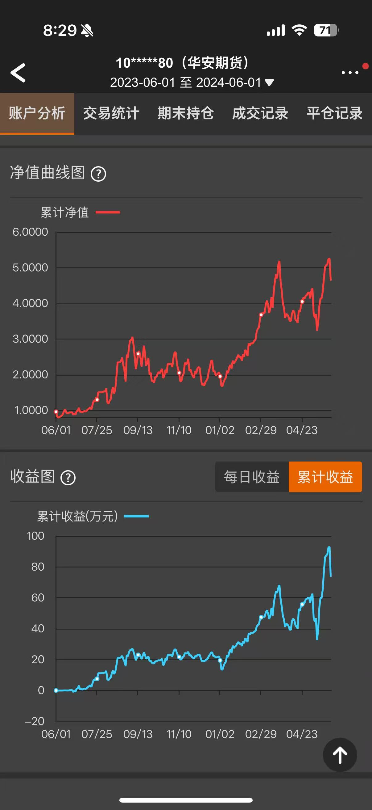

# CN Futures Multi-Agent Trading System

# About the Author

This framework is informed by the author's live trading experience in Chinese commodity futures markets.

The figure below shows the author's personal trading results from **2023-06-01 to 2024-06-01**, recorded through a verified brokerage account at **华安期货 (Huaan Futures)**. The results are independent of this research repository and are provided solely as context for the author's practical market background.



Key observations:

- Peak net value: approximately **5×** (~400% return)
- Peak cumulative profit: approximately **¥920,000 RMB**
- Positive equity drift across multiple Chinese commodity futures regimes

A modular quantitative research framework for Chinese commodity futures trading, focused on:

- Machine-learning-based factor selection
- Leakage-safe medium-frequency research
- Multi-agent trading architecture
- Technical + fundamental signal integration
- Weekly regime-aware risk filtering
- Robust out-of-sample validation

---

## System Architecture

```text
Technical Agent
        +
Fundamental Agent
        +
Risk Agent
```

Designed for systematic CTA-style futures research.

The current implementation emphasizes:

> Single-contract medium-frequency futures trading  
> with strict anti-leakage design and model-comparison consistency.

---

# Research Motivation

Chinese commodity futures exhibit:

- Strong regime switching
- High noise-to-signal ratio
- Highly correlated technical factors
- Inventory and basis-driven structural behavior
- Asymmetric long/short dynamics

Traditional single-factor statistical testing often struggles under:

```text
Nonlinearity
+
Feature interaction
+
Regime dependence
+
High factor collinearity
```

This project instead focuses on:

> Out-of-sample predictive robustness

through unified ML-based factor selection and leakage-safe backtesting.

---

# Project Structure

```text
CN-Futures-Multi-Agent-Trading-System/

├── Backtest/
│   ├── backtest_weekly_func.py
│   └── backtest_weekly_fundamental_func.py
│
├── Price & Volume Data/       # Daily + weekly OHLCV (11 contracts)
├── Fundmental Data/           # Warehouse receipts, spot basis, roll yield (CZCE 5)
│   └── Processed Data/        # Weekly-frequency standardized factors
├── Macro Data/
│   ├── Train/                 # 2017-12 ~ 2020-06
│   └── Test/                  # 2020-07 ~ 2023-12
│
├── Features/
│   ├── features_construction.py
│   ├── features_tag.py
│   ├── features_direction.py
│   ├── features_revision.py
│   ├── features_xgb_selection.py
│   ├── features_rf_selection.py
│   ├── features_lgbm_selection.py
│   ├── features_catboost_selection.py
│   ├── features_mlp_selection.py
│   └── features_elastic_selection.py
│
├── Filters/
│   ├── filter_weekly.py
│   ├── filter_fundamental.py
│   └── filter_monthly.py
│
├── Score/
│   ├── score_fun.py
│   └── base_th.py
│
├── Single-Contract Full Pipeline--Technical + Weekly Filters.ipynb
├── Single-Contract Full Pipeline--Technical + Fundamental Factors.ipynb
└── README.md
```

---

# Trading Universe

Current research covers major Chinese commodity futures contracts:

| Exchange | Contracts |
|---|---|
| CZCE | TA / MA / FG / RM / SR |
| SHFE | AG / AU / CU / HC / RU |
| CZCE | CF |

CZCE contracts (TA / MA / FG / RM / SR) carry full fundamental data coverage (warehouse receipts, spot basis, roll yield). SHFE contracts are included for technical-signal research.

Contracts were selected due to:

- Sufficient liquidity
- Long historical availability
- Strong inventory/basis relevance (CZCE subset)
- Representative industrial-chain behavior

---

# Core Pipeline

```text
Adjusted Daily Futures Data
        ↓
Feature Engineering
        ↓
Forward Return Label Construction  (H = 5 days, TH = 5%)
        ↓
ML Feature Selection
        ↓
Factor Sign Detection
        ↓
Long / Short Split-Score Construction
        ↓
Weekly / Fundamental Filtering
        ↓
Risk-Controlled Backtesting
```

---

# 1. Technical Agent

The Technical Agent transforms adjusted futures OHLCV data into predictive long/short trading signals.

---

## Feature Engineering

The feature universe includes multiple categories of technical and flow-based factors.

### Momentum Features

- Multi-horizon returns
- Momentum slope
- Momentum acceleration
- Momentum angle

### Trend Features

- MA bias
- MA slope
- WMA bias
- Trend acceleration
- Trend angle

### Volatility Features

- Rolling volatility
- ATR-like range measures
- Bollinger-type width
- Volatility expansion/compression

### Flow & Positioning Features

- Volume growth
- Open interest growth
- Volume/OI bias
- Price-volume divergence
- Price-OI divergence

### Oscillator Features

- RSI
- Stochastic K/D/J
- Overbought/oversold pressure
- Mean-reversion pressure

### Candlestick Geometry

- Candle body/range
- Upper/lower shadows
- Gap returns
- Intraday position

---

# 2. Label Construction

The framework uses two independent binary classification tasks.

## Long-side Label

```text
y_up = 1(R[t,t+H] >= TH)
```

## Short-side Label

```text
y_down = 1(R[t,t+H] <= -TH)
```

This creates:

```text
Independent long-side and short-side alpha systems
```

instead of assuming symmetric market behavior.

The framework therefore explicitly models:

```text
Long alpha
≠
Short alpha
```

---

# 3. Machine Learning Feature Selection

A major focus of the project is:

> Consistent cross-model feature selection

under identical research conditions.

---

## Supported Models

| Category | Models |
|---|---|
| Linear Sparse | Elastic Net |
| Bagging Tree | Random Forest |
| Boosting Tree | XGBoost |
| Aggressive Boosting | LightGBM |
| Robust Boosting | CatBoost |
| Neural Tabular | MLP |

---

## Unified Selection Framework

All models share the same outer selection logic:

```text
Rolling OOS
→ OOS permutation importance
→ importance aggregation
→ single-factor OOS AUC
→ final feature selection
```

Only the core algorithm differs.

This allows direct comparison of:

```text
Different models'
factor-selection behavior
```

under a unified framework.

---

## Why This Matters

The project studies whether:

```text
Different ML architectures
select different forms of futures alpha
```

while holding:

- preprocessing
- rolling validation
- feature universe
- score construction
- filtering logic
- backtesting engine

fully constant.

---

# 4. Factor Sign Detection

After feature selection, each factor undergoes:

```text
Directional sign inference
```

to determine whether the factor contributes positively or negatively to:

- long-side prediction
- short-side prediction

Sign inference combines five criteria — quantile bucketing, IC sign, Spearman monotonicity, OLS regression direction, and bootstrap stability — and outputs +1 / −1 / 0 (discard) based on a confidence vote.

The framework therefore separates:

```text
Feature usefulness
and
Directional contribution
```

instead of assuming monotonic behavior.

---

# 5. Long / Short Split-Score Construction

Selected factors are transformed into:

```text
score_long
score_short
```

through:

- train-only normalization
- z-score transformation (robust median/MAD)
- inferred factor direction
- correlation-filtered weighted aggregation

The framework intentionally avoids:

```text
Single symmetric score construction
```

because long and short futures behavior is often asymmetric.

Signal entry thresholds are **volatility-adaptive**: `base_th` scales linearly with the contract's median rolling volatility estimated from training data.

---

# 6. Weekly Risk Agent

The Risk Agent applies weekly regime-aware filtering before trade execution.

---

## Weekly Trend Filter

Uses weekly moving-average structure:

```text
Fast weekly MA
vs
Slow weekly MA
```

to determine directional trend regimes.

---

## Weekly Volatility Regime

Weekly rolling volatility z-scores classify regimes into:

- low volatility
- mid volatility
- high volatility

This prevents aggressive trading during unstable environments.

---

## Crowded Long / Short Filter

Combines:

- Open-interest expansion
- Price acceleration

to identify potentially crowded positioning conditions.

---

## Leakage Prevention

All weekly information is:

```text
Shifted by one full week
```

before entering daily trading logic.

This prevents:

```text
Future weekly information leakage
```

inside the daily backtest engine.

---

# 7. Fundamental Agent

The framework additionally supports commodity-specific fundamental filtering.

Current implementations include:

- Warehouse receipt factors
- Basis factors
- Weekly inventory pressure
- Basis regime gating

The project focuses primarily on:

```text
Inventory pressure
+
Basis dynamics
```

rather than broad macro forecasting.

---

## Fundamental Design Philosophy

The framework assumes:

```text
Commodity futures are strongly influenced by:
inventory structure,
delivery pressure,
and basis regime behavior.
```

Fundamental filters therefore act as:

```text
Regime gates
```

instead of direct price predictors.

Fundamental factors are lagged by one week before merging into daily data to prevent weekly information leakage.

---

# 8. Leakage-Safe Research Design

A major focus of the project is:

> Strict anti-leakage implementation

including:

- Chronological train/test split
- Train-only normalization
- Rolling OOS validation
- Shifted weekly filters
- Forward-return-safe labels
- OOS permutation importance
- Train-only z-score statistics

The framework intentionally avoids:

```text
Full-sample normalization
Future regime contamination
merge_asof leakage
```

commonly found in retail backtests.

---

# 9. Backtesting Engine

The project includes a capital-based CTA-style backtesting engine with:

- Long/short trading
- Leverage control
- Position sizing
- Stop-loss / take-profit
- Maximum holding period
- Weekly gating
- Fundamental gating (warehouse + basis)

The engine records:

- Trade-level statistics
- Exit reasons
- Equity curves
- Sharpe ratio
- Drawdown metrics
- Worst-loss statistics

---

# Research Philosophy

The framework intentionally prioritizes:

```text
Out-of-sample robustness
over
in-sample fit
```

The project therefore emphasizes:

- Rolling OOS validation
- Cross-model agreement
- Cross-regime stability
- Leakage-safe evaluation
- Consistent research conditions

rather than purely maximizing:

```text
Training accuracy
```

or:

```text
In-sample statistical significance
```

---

# Current Research Focus

Ongoing work includes:

- Cross-model factor comparison
- Weekly/fundamental regime filtering
- Long/short asymmetry analysis
- Feature robustness analysis
- Contract-level transferability
- Fundamental gating effectiveness

---

# Future Directions

Potential future extensions include:

- Multi-contract portfolio optimization
- Cross-sectional futures selection
- Portfolio-level risk allocation
- Regime clustering
- Multi-frequency integration
- Reinforcement-learning overlays
- LLM-assisted macro/fundamental agents

---

# Related Research

The project is conceptually related to recent work on:

- Multi-agent trading systems
- AI-assisted quantitative research pipelines
- ML-based factor selection
- Regime-aware trading architectures

Related references include:

- [TradingAgents](https://arxiv.org/abs/2412.20138)
- [QuantAgents](https://arxiv.org/abs/2510.04643)

These references are used as:

```text
Research-direction inspiration
```

rather than direct reproductions.

---


# Disclaimer

This repository is intended solely for:

```text
Quantitative research
and educational purposes
```

and does not constitute financial advice.
